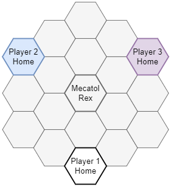
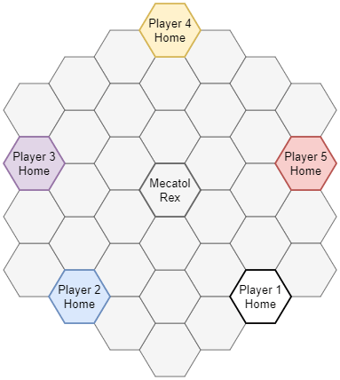
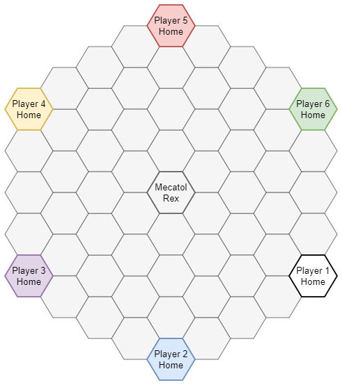
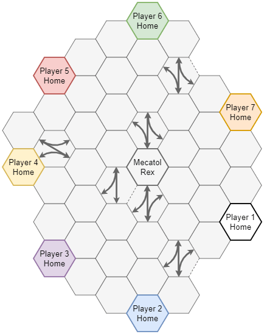
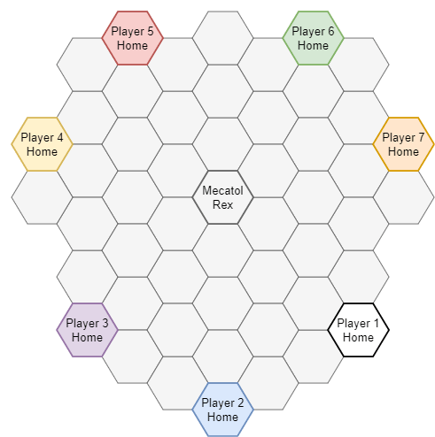
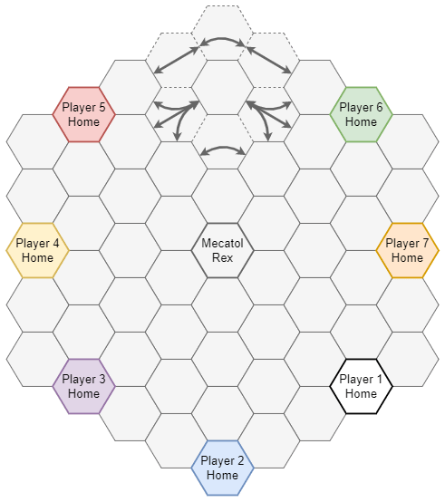
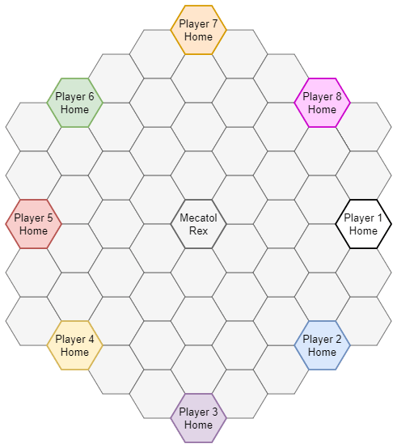

[View on GitHub.io](https://acodcha.github.io/ti4-cartographer) · [View on GitHub.com](https://github.com/acodcha/ti4-cartographer)

[Board Layouts](#board-layouts) · [Setup](#setup) · [Usage](#usage) · [Documentation](#documentation) · [License](#license)


# Board Layouts

- 2 Players: [Regular](#board-layout-2-players-regular)
- 3 Players: [Regular](#board-layout-3-players-regular), [Small](#board-layout-3-players-small), [Large](#board-layout-3-players-large)
- 4 Players: [Regular](#board-layout-4-players-regular), [Small](#board-layout-4-players-small), [Large](#board-layout-4-players-large)
- 5 Players: [Regular](#board-layout-5-players-regular), [Small](#board-layout-5-players-small), [Large](#board-layout-5-players-large)
- 6 Players: [Regular](#board-layout-6-players-regular), [Large](#board-layout-6-players-large)
- 7 Players: [Regular](#board-layout-7-players-regular), [Small](#board-layout-7-players-small), [Large](#board-layout-7-players-large)
- 8 Players: [Regular](#board-layout-8-players-regular), [Large](#board-layout-8-players-large)

[(Back to Top)](#)

## Board Layout: 2 Players Regular

5 planetary systems and 3 anomaly/wormhole/empty systems per player. This board layout has 67% more planets per player than normal, so `--aggression high` and playing to 14 victory points are recommended.

```BASH
ti4cartographer --players 2 --layout regular
```


[(Back to Board Layouts)](#board-layouts)

## Board Layout: 3 Players Regular

3 planetary systems and 2 anomaly/wormhole/empty systems per player. Uses hyperlanes. Requires the Prophecy of Kings Expansion. This board layout is well balanced, so `--aggression moderate` and playing to 10 victory points are recommended.

```BASH
ti4cartographer --players 3 --layout regular
```


[(Back to Board Layouts)](#board-layouts)

## Board Layout: 3 Players Small

3 planetary systems and 2 anomaly/wormhole/empty systems per player. This board layout has home systems closer to Mecatol Rex than normal but further away from each other than normal, so `--aggression moderate` and playing to 10 victory points are recommended.

```BASH
ti4cartographer --players 3 --layout small
```



[(Back to Board Layouts)](#board-layouts)

## Board Layout: 3 Players Large

5 planetary systems and 3 anomaly/wormhole/empty systems per player. This board layout has 67% more planets per player than normal and has home systems much further away from each other than normal, so `--aggression high` and playing to 14 victory points are recommended.

```BASH
ti4cartographer --players 3 --layout large
```


[(Back to Board Layouts)](#board-layouts)

## Board Layout: 4 Players Regular

3 planetary systems and 2 anomaly/wormhole/empty systems per player. Uses hyperlanes. Requires the Prophecy of Kings Expansion. This board layout is well balanced, so `--aggression moderate` and playing to 10 victory points are recommended.

```BASH
ti4cartographer --players 4 --layout regular
```


[(Back to Board Layouts)](#board-layouts)

## Board Layout: 4 Players Small

3 planetary systems and 2 anomaly/wormhole/empty systems per player, with 1 additional planetary system and 1 additional anomaly/wormhole/empty system. This board layout has home systems further away from each other than normal, so `--aggression high` and playing to 10 victory points are recommended.

```BASH
ti4cartographer --players 4 --layout small
```


[(Back to Board Layouts)](#board-layouts)

## Board Layout: 4 Players Large

5 planetary systems and 3 anomaly/wormhole/empty systems per player. This board layout has 67% more planets per player than normal and has home systems further away from each other than normal, so `--aggression high` and playing to 14 victory points are recommended.

```BASH
ti4cartographer --players 4 --layout large
```


[(Back to Board Layouts)](#board-layouts)

## Board Layout: 5 Players Regular

3 planetary systems and 2 anomaly/wormhole/empty systems per player. Uses hyperlanes. Requires the Prophecy of Kings Expansion. This board layout is well balanced, so `--aggression moderate` and playing to 10 victory points are recommended.

```BASH
ti4cartographer --players 5 --layout regular
```


[(Back to Board Layouts)](#board-layouts)

## Board Layout: 5 Players Small

3 planetary systems and 2 anomaly/wormhole/empty systems per player. This board layout is well balanced, so `--aggression moderate` and playing to 10 victory points are recommended.

```BASH
ti4cartographer --players 5 --layout small
```


[(Back to Board Layouts)](#board-layouts)

## Board Layout: 5 Players Large

4 planetary systems and 2 anomaly/wormhole/empty systems per player, with 1 additional anomaly/wormhole/empty system. This board layout has 33% more planets per player than normal, so `--aggression high` and playing to 12–14 victory points are recommended.

```BASH
ti4cartographer --players 5 --layout large
```



[(Back to Board Layouts)](#board-layouts)

## Board Layout: 6 Players Regular

3 planetary systems and 2 anomaly/wormhole/empty systems per player. This board layout is well balanced, so `--aggression moderate` and playing to 10 victory points are recommended.

```BASH
ti4cartographer --players 6 --layout regular
```


[(Back to Board Layouts)](#board-layouts)

## Board Layout: 6 Players Large

6 planetary systems and 3 anomaly/wormhole/empty systems per player. Requires the Prophecy of Kings Expansion. This board layout has twice as many planets per player than normal and has home systems further away from Mecatol Rex than normal, so `--aggression high` and playing to 14 victory points are recommended.

```BASH
ti4cartographer --players 6 --layout large
```



[(Back to Board Layouts)](#board-layouts)

## Board Layout: 7 Players Regular

3 planetary systems and 2 anomaly/wormhole/empty systems per player. Uses hyperlanes. Requires the Prophecy of Kings Expansion. This board layout is well balanced, so `--aggression moderate` and playing to 10 victory points are recommended.

```BASH
ti4cartographer --players 7 --layout regular
```



[(Back to Board Layouts)](#board-layouts)

## Board Layout: 7 Players Small

4 planetary systems and 2 anomaly/wormhole/empty systems per player, with 1 additional planetary system and 1 additional anomaly/wormhole/empty system. Requires the Prophecy of Kings Expansion. This board layout has 38% more planets per player than normal and has home systems further away from Mecatol Rex than normal, so `--aggression high` and playing to 12–14 victory points are recommended.

```BASH
ti4cartographer --players 7 --layout small
```



[(Back to Board Layouts)](#board-layouts)

## Board Layout: 7 Players Large

4 planetary systems and 2 anomaly/wormhole/empty systems per player, with 3 additional planetary systems and 2 additional anomaly/wormhole/empty systems. Uses hyperlanes. Requires the Prophecy of Kings Expansion. This board layout has 48% more planets per player than normal and has home systems further away from Mecatol Rex than normal, so `--aggression high` and playing to 14 victory points are recommended.

```BASH
ti4cartographer --players 7 --layout large
```



[(Back to Board Layouts)](#board-layouts)

## Board Layout: 8 Players Regular

3 planetary systems and 2 anomaly/wormhole/empty systems per player. Uses hyperlanes. Requires the Prophecy of Kings Expansion. This board layout is well balanced, so `--aggression moderate` and playing to 10 victory points are recommended.

```BASH
ti4cartographer --players 8 --layout regular
```


[(Back to Board Layouts)](#board-layouts)

## Board Layout: 8 Players Large

4 planetary systems and 2 anomaly/wormhole/empty systems per player, with 2 additional planetary systems and 2 additional anomaly/wormhole/empty systems. Requires the Prophecy of Kings Expansion. This board layout has 42% more planets per player than normal and has home systems further away from Mecatol Rex than normal, so `--aggression high` and playing to 14 victory points are recommended.

```BASH
ti4cartographer --players 8 --layout large
```



[(Back to Board Layouts)](#board-layouts)

# Setup

The following packages are required:

- **C++17 Compiler:** Any C++17 compiler will do, such as GCC or Clang. On Ubuntu, install GCC with `sudo apt install g++` or Clang with `sudo apt install clang`.
- **CMake:** On Ubuntu, install with `sudo apt install cmake`.

Build the programs with:

```BASH
mkdir build
cd build
cmake ..
make -j
```

This builds the main program, `build/bin/ti4cartographer`, as well as the `build/bin/ti4atlas` utility.

- `ti4cartographer` is the main program used to generate a randomized balanced board.
- `ti4atlas` is a small utility program that prints the various systems ranked from best to worst.

You can optionally run tests from the `build` directory with:

```BASH
make test
```

You can optionally install the programs from the `build` directory with:

```BASH
sudo make install
```

This installs the programs to `/usr/local/bin/ti4cartographer` and `/usr/local/bin/ti4atlas`. To uninstall a program, simply delete it.

[(Back to Top)](#)

# Usage

The `ti4cartographer` program computes an optimal board and outputs its Tabletop Simulator string. Run `ti4cartographer` with no arguments or with the `--help` argument to obtain usage information. Otherwise, for regular use, run `ti4cartographer` with:

```BASH
ti4cartographer  --players <number>  --layout <type>  --aggression <type>  --version <type>  --quiet
```

- `--players <number>`: Required. Specifies the number of players. Choices are `2`, `3`, `4`, `5`, `6`, `7`, or `8`.
- `--layout <type>`: Optional. Specifies the board layout. Choices vary by number of players, but typically include `regular`, `small`, or `large`; see the [Board Layouts](#board-layouts) section. The default is `regular`.
- `--aggression <type>`: Optional. Specifies the degree of expected aggression resulting from the placement of systems on the board. Choices are `low`, `moderate`, or `high`. The default is `moderate`. Higher aggression places better systems at equidistant positions compared to the systems in each player's slice, whereas lower aggression does the opposite.
- `--version <type>`: Optional. Determines whether the system tiles from the Prophecy of Kings expansion can be used. Choices are `base` or `expansion`. The default is `expansion`. Note that 7 and 8 player games require the Prophecy of Kings expansion.
- `--quiet`: Optional. Activates quiet mode, where the only console output is the generated board's Tabletop Simulator string.

The `ti4atlas` utility takes no arguments and simply prints out a list of the various systems ranked from best to worst. This ranking only takes into account the individual systems by themselves, and does not account for position on the game board, balance of planets, resources, and influence, suitability as a forward outpost, or other interactions; such considerations are handled by the `ti4cartographer` program.

[(Back to Top)](#)

# Documentation

Building the documentation is optional and requires additional packages:

- **Doxygen:** On Ubuntu, install with `sudo apt install doxygen`.
- **Graphviz:** On Ubuntu, install with `sudo apt install graphviz`.
- **TeX Live:** On Ubuntu, install with `sudo apt install texlive texlive-fonts-extra`.

Documentation is disabled by default but can be generated from the `build` directory with:

```BASH
cmake .. -DBUILD_DOCS=ON
make docs
```

This generates HTML documentation using Doxygen. The documentation is located in `docs/html`. Open the `docs/html/index.html` file in any web browser to view the documentation.

[(Back to Top)](#)

# License

This work is maintained by Alexandre Coderre-Chabot (<https://github.com/acodcha>) and licensed under the MIT License. For more details, see the [LICENSE](LICENSE) file or <https://mit-license.org/>. This work is based on the Twilight Imperium 4th Edition board game by Fantasy Flight Games. The contents, copyrights, and trademarks of everything involving Twilight Imperium 4th Edition are exclusively held by Fantasy Flight Games; I make no claim to any of these in any way.

[(Back to Top)](#)
